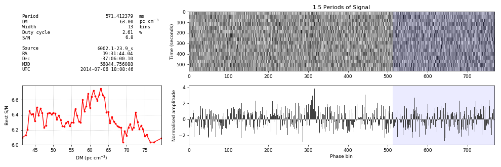

[](https://arxiv.org/abs/2004.03701)           [](https://codecov.io/gh/v-morello/riptide)

# riptide

__riptide__ ("sea**r**ch**i**ng for **p**ulsars in the **ti**me **d**omain") is a pulsar searching package implementing the Fast Folding Algorithm (FFA), the theoretically optimal search method for periodic signals. Its interface is entirely in python while the core algorithms are implemented in C. riptide provides:  

* A library of functions and classes to use interactively to process dedispersed time series  
* A pipeline executable to process a set of DM trials and output a list of candidate files and other useful data products  

## Citation

If using ``riptide`` contributes to a project that leads to a scientific publication, please cite the article:  
["Optimal periodicity searching: Revisiting the Fast Folding Algorithm for large scale pulsar surveys"](https://arxiv.org/abs/2004.03701)


## Sensitivity of the FFA

The article covers the topic of the FFA's sensitivity in theory, here is a practical example on a faint source. Below is an L-band observation of [PSR J1932-3655](https://www.atnf.csiro.au/people/joh414/ppdata/1932-3655.html) from the [SUPERB survey](https://arxiv.org/abs/1706.04459), significantly offset from the true position of the source. The first plot was obtained by folding the observation using the known ephemeris of the pulsar with [PSRCHIVE](http://psrchive.sourceforge.net/). This is one of the faintest known pulsar instances identifiable in the survey.

  

And below is a blind detection of the pulsar, running `riptide` on the same observation:  



## Documentation

A quickstart guide, a pipeline configuration tutorial and the full API documentation can be found [here](https://riptide-ffa.readthedocs.io).

## Installation

The easiest method is to use pip install, which pulls the latest release from the python package index and installs all required dependencies:
```
pip install riptide-ffa
```

The alternative is to clone the repository, especially if you want the absolute latest version:
```bash
git clone https://github.com/v-morello/riptide
```

And then in the base directory of `riptide` run

```bash
make install
```

This simply runs ``pip install`` in [editable mode](https://pip.pypa.io/en/latest/reference/pip_install/#editable-installs), which means you can freely edit the code. It also installs any required dependencies with ``pip`` that are not present already. The installer also adds links to two command-line apps in your python environment using [console_scripts entry points](https://python-packaging.readthedocs.io/en/latest/command-line-scripts.html):  

* `rffa`: The full end-to-end pipeline to search multiple DM trials, see below for details on how to use it.
* `rseek`: A lightweight app to search a single time series and print significant candidates found, useful for quick data checks.

You may check that it all works by typing:  
```
rffa -h
rseek -h
```
And you should see the full help of both applications.


