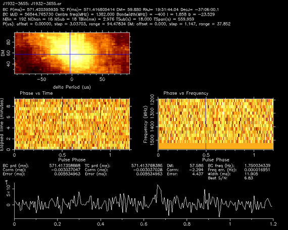

[](https://arxiv.org/abs/2004.03701)         [](https://travis-ci.com/v-morello/riptide)   [](https://codecov.io/gh/v-morello/riptide)

# riptide

__riptide__ ("sea**r**ch**i**ng for **p**ulsars in the **ti**me **d**omain") is a pulsar searching package implementing the Fast Folding Algorithm (FFA), the theoretically optimal search method for periodic signals. Its interface is entirely in python while the core algorithms are implemented in C. riptide provides:  

* A library of functions and classes to use interactively to process dedispersed time series  
* A pipeline executable to process a set of DM trials and output a list of candidate files and other useful data products  

## Citation

If using ``riptide`` contributes to a project that leads to a scientific publication, please cite the article:  
["Optimal periodicity searching: Revisiting the Fast Folding Algorithm for large scale pulsar surveys"](https://arxiv.org/abs/2004.03701)


## Sensitivity of the FFA

The article covers the topic of the FFA's sensitivity in theory, here is a practical example on a faint source. Below is an L-band observation of [PSR J1932-3655](https://www.atnf.csiro.au/people/joh414/ppdata/1932-3655.html) from the [SUPERB survey](https://arxiv.org/abs/1706.04459), significantly offset from the true position of the source. The first plot was obtained by folding the observation using the known ephemeris of the pulsar with [PSRCHIVE](http://psrchive.sourceforge.net/). This is one of the faintest known pulsar instances identifiable in the survey.

  

And below is a blind detection of the pulsar, running `riptide` on the same observation:  


## Installation

The easiest method is to use pip install, which pulls the latest release from the python package index and installs all required dependencies:
```
pip install riptide-ffa
```

The alternative is to clone the repository, especially if you want the absolute latest version:
```bash
git clone https://github.com/v-morello/riptide
```

And then in the base directory of `riptide` run

```bash
make install
```

This simply runs ``pip install`` in [editable mode](https://pip.pypa.io/en/latest/reference/pip_install/#editable-installs), which means you can freely edit the code. It also installs any required dependencies with ``pip`` that are not present already. The installer also adds links to two command-line apps in your python environment using [console_scripts entry points](https://python-packaging.readthedocs.io/en/latest/command-line-scripts.html):  

* `rffa`: The full end-to-end pipeline to search multiple DM trials, see below for details on how to use it.
* `rseek`: A lightweight app to search a single time series and print significant candidates found, useful for quick data checks.

You may check that it all works by typing:  
```
rffa -h
rseek -h
```
And you should see the full help of both applications.

## Basic Usage: searching a single time series

The core functionality of riptide is to take a single time series as an input and calculate its *periodogram*: the S/N as a function of trial period and trial pulse width.

#### Load a time series, or create a fake one

Time series (or single DM trials) are encapsulated in the `TimeSeries` class. We can either create an artificial train of pulses (plus some white noise) for test purposes, or load some real data created with some popular pulsar software packages.

```python
from riptide import TimeSeries
# Generate an artificial train of pulses with a white noise background
# 600s of data, 256us sampling time, a period of pi seconds and a duty cycle of 2%
tseries_fake = TimeSeries.generate(length=600.0, tsamp=256e-6, period=3.14159, ducy=0.02)

# We can also load an existing time series created by PRESTO or SIGPROC
tseries_presto = TimeSeries.from_presto_inf("~/work/pulsars/presto_time_series/J1855+0307/J1855+0307_DM400.00.inf")
tseries_sigproc = TimeSeries.from_sigproc("~/work/pulsars/sigproc_time_series/J0636-4549.sigproc.tim")
```


#### Computing and manipulating periodograms

Periodograms are computed with the `ffa_search` function, which takes as input a `TimeSeries` and many keyword arguments. The search period range is specified via `period_min` and `period_max`. The duty cycle resolution of the search is set by `bins_min` and `bins_max`; due to how the search is performed under the hood, it is recommended to make `bins_max` approximately 10% larger than `bins_min`.

```python
from riptide import ffa_search

# Compute periodogram
ts, plan, pgram = ffa_search(tseries_sigproc, rmed_width=4.0, period_min=1.0, period_max=10.0, bins_min=240, bins_max=260)

# Plot S/N vs. trial period
pgram.display()
```

`ffa_search` returns three outputs:

1. The de-reddened and normalised copy of the input time series that was actually searched  
2. The search plan that was followed, specifying how the data was iteratively downsampled across the entire search period range  
3. The output `Periodogram`  

Periodograms are actually two-dimensional: they represent a S/N as a function of both trial period and trial width, as shown below. The `display()` method only shows S/N for the best trial width.

```python
# Trial periods in seconds, trial widths in number of phase bins, output S/N
# pgram.display() only shows pgram.snrs.max(axis=1)
print(pgram.periods.size, pgram.widths.size, pgram.snrs.shape)
> 124778 10 (124778, 10)
```

#### Important detail: the metadata attribute

All `TimeSeries` objects and all derived data products (periodogram, pulsar search candidates, etc.) in riptide have a `metadata` dictionary carrying whatever information provided by the software package that created the input time series data. There is of course no header standardization for such data in pulsar astronomy, and the information contained in `metadata` will therefore vary across software packages and observatories. We do however attempt to guarantee some metadata uniformity in riptide, by always enforcing the presence of the following metadata keys and their associated data types:

* `dm`: `float`, dispersion measure of the input data  
* `fname`: `str`, original file name  
* `mjd`: `float`, epoch of observation  
* `source_name`: `str`  
* `skycoord`: `astropy.SkyCoord`, source coordinates  
* `tobs`: `float`, integration time in seconds  

If these required attributes were not provided by the original creator of the time series, they are set to the special value `None`. Here's for example the metadata for the SIGPROC time series loaded in code snippet above:

```python
print(tseries_sigproc.metadata)

{'az_start': 0.0,
 'barycentric': 0,
 'data_type': 2,
 'dm': 26.31,
 'fch1': 1581.8046875,
 'fname': '/home/vince/work/pulsars/sigproc_time_series/J0636-4549.sigproc.tim',
 'machine_id': 10,
 'mjd': 56771.1303125,
 'nbits': 32,
 'nchans': 1,
 'nifs': 1,
 'refdm': 26.31,
 'skycoord': <SkyCoord (ICRS): (ra, dec) in deg
    (99.17595833, -45.73472222)>,
 'source_name': 'G255.3-21.9_s',
 'src_dej': -454405.0,
 'src_raj': 63642.23,
 'telescope_id': 4,
 'tobs': 557.040896,
 'tsamp': 6.4e-05,
 'tstart': 56771.1303125,
 'za_start': 0.0}
```

### FFA base functions

The python interface of `riptide` exposes some lower-level functions related to calculating the folding transform (interchangeably called FFA transform) of input data at some base integer period. See the documentation of these functions for more details. These are:  

* `ffa2`: FFA transform of a two-dimensional input that represents a pulse stack. The `m` lines of the input represent pulses in chronological order, and the `p` columns represent the phase dimension  
* `ffa1`: FFA transform of a one-dimensional input, that represents a time series. The function simply selects the largest number of entire pulses that fit in the data, reshapes them into a two-dimensional array, and calls `ffa2()`  
* `ffafreq`: Returns the trial folding frequencies corresponding to every line in the output of an FFA transform  
* `ffaprd`: Same as `ffafreq`, but returns trial periods instead  


### The rseek command-line app

`rseek` is just a handy way of running `ffa_search()` on a single DM trial from the command-line. It loads the file, runs `ffa_search()`, gets the parameters of all significant periodogram peaks with the `find_peaks()` function and prints them in a table. `rseek` does not save any candidate files or data products; for serious purposes, use the full pipeline (see next section). Here's an example on a 9-minute Parkes observation of J1855+0307, a pulsar with a 845.3 ms period and a dispersion measure of 402.5 pc cm<sup>-3</sup>. We prealably dedispersed the data at DM = 400 pc cm<sup>-3</sup> using PRESTO. We search a small range of periods around that of the pulsar, which comes out as the top candidate followed by a number of harmonic detections.

```bash
$ rseek --Pmin 0.5 --Pmax 2.0 --bmin 480 --bmax 520 -f presto J1855+0307_DM400.00.inf
       period          freq  width     ducy       dm    snr
  0.845357496   1.182931488      9    1.80%   400.00   18.8
  1.690691667   0.591473903      3    0.60%   400.00   13.5
  0.563578039   1.774377159     13    2.61%   400.00    9.8
  1.268019042   0.788631690      4    0.80%   400.00    8.6
  1.868482971   0.535193532    141   28.26%   400.00    8.4
  1.127142787   0.887199041      6    1.20%   400.00    7.1
```


## Large scale survey usage: searching multiple DM trials

Multiple DM trial searches are managed by the `Pipeline` class in the `riptide.pipeline` submodule. The pipeline executable needs at least two inputs:  

* A configuration file in `YAML` format, of which a number of well-commented examples are provided in the `pipeline/config` directory. To get started, copy one of these files, read the comments carefully and start tweaking them to your needs. The pipeline is highly configurable. This is where the user must specify any required parameters of the observation (e.g. top and bottom bserving frequencies), the desired DM range, the desired search period range(s) and the duty cycle resolution, etc.  
* A list of dedispersed time series files, obtained by dedispersing the same observation. If your files have been produced by [PRESTO](https://github.com/scottransom/presto), you need to pass a list of `.inf` header files (the associated `.dat` files are expected to be in the same directory). *The input data format must be specified in the configuration file.*  

You can optionally set an output directory as well, otherwise the current working directory is used. Here's an example:
```
rffa --config myConfig.yml --outdir search_output input_data/*.inf
```

Type `rffa -h` for help on all arguments accepted by the pipeline application. Once the pipeline finishes, the following data products will be written in the specified output directory:  

* A CSV table of all detected periodogram peaks across all DM trials  
* A CSV table of clusters, obtained by grouping together peaks with frequencies close to each other  
* A CSV table of candidates, which will have the same entries as the clusters table, unless you have enabled harmonic filtering in the config file. In this case any cluster that was flagged as a harmonic of another is removed from the final candidate list.  
* One JSON file per candidate, which can be loaded using `riptide.load_json()` and plotted / manipulated. These contain header information, a table of peaks associated to the candidate, and a sub-integration plots obtained by folding the DM trial at which they were detected with the highest S/N.  
* One PNG plot per candidate, if the associated option was enabled in the configuration file.  


## Docker image

The riptide Dockerfile is located in the 'docker' subdirectory. To build the image, simply type:

```bash
make docker
```

Which builds an image named `riptide-ffa`. Both python and ipython are installed within the docker image. To start a container:

```bash
docker run -it --rm riptide-ffa
```

Refer to your favourite docker cheat sheet for further information and advanced usage.
