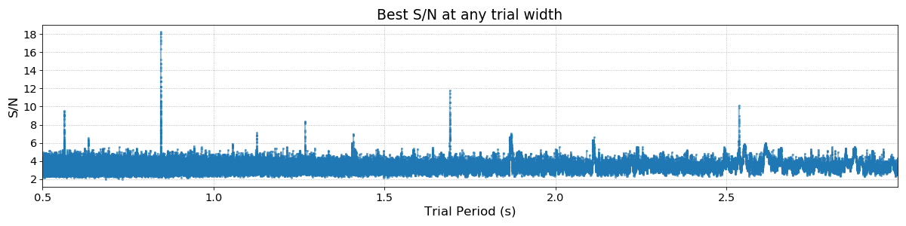
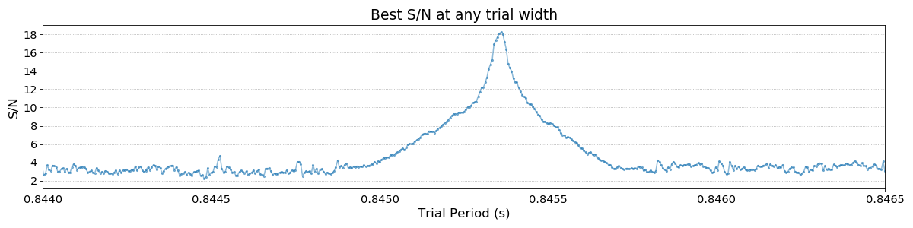
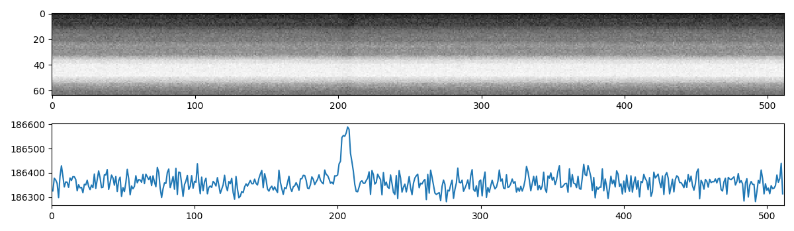
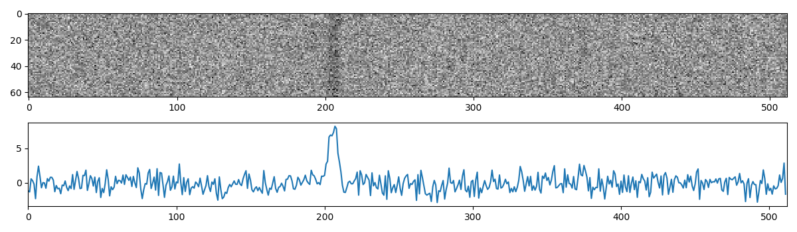

Quickstart Guide
================

The core functionality of riptide is to take a single time series as an input and calculate its 
*periodogram*: the S/N as a function of trial period and trial pulse width. In this section we'll
look at how to use the basic building blocks of ``riptide`` to interactively process a single 
dedispersed time series, using either IPython or Jupyter Notebook.

Loading and generating data
---------------------------
Dedispersed time series are encapsulated by the ``TimeSeries`` class.
We can either create an artificial train of pulses (plus some white noise) for test purposes, 
or load some real data created with some popular pulsar software packages.

.. code-block:: python

   from riptide import TimeSeries

   # Generate an artificial train of pulses with a white noise background
   # 600s of data, 256us sampling time, a period of pi seconds, a duty cycle of 2% and a
   # true S/N of 20
   tseries_fake = TimeSeries.generate(
       length=600.0, tsamp=256e-6, period=3.14159, ducy=0.02, amplitude=20.0)

   # We can also load an existing time series created by SIGPROC's dedisperse
   tseries_sigproc = TimeSeries.from_sigproc("J0636-4549.sigproc.tim")

   # ... or by PRESTO's prepsubband
   tseries_presto = TimeSeries.from_presto_inf("J1855+0307_DM400.00.inf")

Computing and manipulating Periodograms
---------------------------------------

Periodograms are computed by :func:`riptide.ffa_search`. It takes as 
input a ``TimeSeries`` and a number of keyword arguments. The search period range is specified via 
``period_min`` and ``period_max``. The duty cycle resolution of the search is set by 
``bins_min`` and ``bins_max``; a good choice is to make ``bins_max`` approximately 10% larger than
``bins_min``, as an optimal compromise between getting uniform duty cycle resolution and 
fast code execution. 

Following the example above, let's search the PRESTO time series for periods between 0.5 and 3.0 
seconds with a moderate duty cycle resolution, using around 250 phase bins in the search process.
The file was obtained by dedispersing a 9-minute Parkes L-band observation of the pulsar 
`PSR J1855+0307`__ at DM = 400.0; this source has a barycentric period of 845.35 ms.

__ https://www.atnf.csiro.au/research/pulsar/psrcat/proc_form.php?version=1.63&JName=JName&RaJ=RaJ&DecJ=DecJ&P0=P0&DM=DM&S1400=S1400&startUserDefined=true&c1_val=&c2_val=&c3_val=&c4_val=&sort_attr=jname&sort_order=asc&condition=&pulsar_names=J1855%2B0307&ephemeris=short&coords_unit=raj%2Fdecj&radius=&coords_1=&coords_2=&style=Long+with+last+digit+error&no_value=*&fsize=3&x_axis=&x_scale=linear&y_axis=&y_scale=linear&state=query&table_bottom.x=41&table_bottom.y=17

.. code-block:: python

   from riptide import ffa_search

   # Compute periodogram
   ts, pgram = ffa_search(
      tseries_presto, period_min=0.5, period_max=3.0, bins_min=240, bins_max=260, rmed_width=4.0)

The ``rmed_width`` argument is the width (in seconds) of the running median filter subtracted from 
the data before searching it. Why this is almost always necessary will be apparent below. 
``ffa_search()`` returns:

* The de-reddened and normalised copy of the input time series that was actually searched
* The output ``Periodogram``

Periodograms are actually two-dimensional: they represent S/N as a function of both trial period 
and trial boxcar width, as shown below.

.. code-block:: python

   >>> pgram.periods
   array([0.5       , 0.50000186, 0.50000372, ..., 2.99981621, 2.9998816 ,
         2.99994699])

   >>> pgram.widths
   array([ 1,  2,  3,  4,  6,  9, 13, 19, 28, 42])

   >>> pgram.snrs
   array([[2.2897673, 2.5737493, 2.691255 , ..., 1.8121176, 1.5684437,
           1.3613055],
          [2.7376328, 2.2606688, 2.177459 , ..., 2.1633167, 1.6055042,
           1.4438173],
          [2.8326738, 2.6165843, 2.4730375, ..., 2.0199502, 1.6867918,
           1.494078 ],
           ...,
          [2.596437 , 3.1851096, 3.9950302, ..., 2.0558238, 2.0880716,
           2.150695 ],
          [2.6923108, 3.4206548, 3.9569635, ..., 2.0991948, 1.9137496,
           2.145636 ],
          [2.862913 , 3.8317175, 4.326064 , ..., 2.2722037, 1.9550049,
           2.2139273]], dtype=float32)

   >>> pgram.snrs.shape
   (232698, 10)

We can plot the periodogram with the ``display()`` method, which shows S/N for 
the best trial width only:

.. code-block:: python
   
   # Equivalent to: plot(pgram.periods, pgram.snrs.max(axis=1))
   pgram.display()

The fundamental period of the pulsar is visible along with a number of harmonics. Zooming in on the
main peak we can fully appreciate the period resolution of the FFA:

Peak Detection Algorithm
------------------------

Periodogram peaks can be quickly and automatically found by :func:`riptide.find_peaks`. It returns a list of
peaks sorted by decreasing S/N, and a dictionary containing the polynomial coefficients of the 
fitted selection threshold; the latter can be safely ignored except for very specific purposes.

.. code-block:: python

   >>> peaks, __ = find_peaks(pgram)
   >>> main_peak = peaks[0]
   >>> print(main_peak)

   Peak(period=0.8453599547405023, freq=1.182928046676835, width=4, ducy=0.0163265306122449, 
      iw=3, ip=114078, snr=18.23371124267578, dm=400.0)

``Peak`` objects are python ``namedtuples``. Here our pulsar is optimally detected at a trial
boxcar width of 4 bins and a period of 845.36 ms. It is important to note that the peak selection 
threshold algorithm is applied to **every** trial width separately, which means that a
sufficiently bright signal will produce multiple peaks, up to one per trial width. This
significantly improves the detectability of narrow, long period pulsed signals; the topic is 
discussed further Section 5 of the reference paper.

Making a sub-integrations plot
------------------------------

We can now fold the **original** data at the best detection period and have a look at the signal
that we found:

.. code-block:: python

   bins = 512
   subints = tseries_presto.fold(main_peak.period, bins, subints=64)

   import matplotlib.pyplot as plt
   plt.subplot(211)
   plt.imshow(subints, cmap='Greys', aspect='auto')
   plt.subplot(212)
   plt.plot(subints.sum(axis=0))
   plt.xlim(0, bins)

Not exactly what we might have expected. The data are dominated by red noise, but we can instead
fold the **de-reddened** version of the data produced (and searched) by ``ffa_search()``:

.. code-block:: python

   bins = 512
   # This copy of the time series has been running median subtracted
   subints = ts.fold(main_peak.period, bins, subints=64)

   import matplotlib.pyplot as plt
   plt.subplot(211)
   plt.imshow(subints, cmap='Greys', aspect='auto')
   plt.subplot(212)
   plt.plot(subints.sum(axis=0))
   plt.xlim(0, bins)

The pulsar signal now appears clearly, and has been visibly folded at the correct period.

The Metadata attribute
----------------------

All ``TimeSeries`` objects and all derived data products (periodograms, pulsar search candidates,
etc.) in riptide have a ``Metadata`` dictionary carrying whatever information provided by the 
software package that created the input time series data. There is no header standardization for 
such data in pulsar astronomy, and the information contained in ``Metadata`` will therefore vary 
across software packages and observatories. We do however attempt to guarantee some metadata 
uniformity in riptide, by always enforcing the presence of the following metadata keys and their 
associated data types:

* ``dm``: ``float``, dispersion measure of the input data  
* ``fname``: ``str``, original file name  
* ``mjd``: ``float``, epoch of observation  
* ``source_name``: ``str``
* ``skycoord``: ``astropy.SkyCoord``, source coordinates  
* ``tobs``: ``float``, integration time in seconds  

If these required attributes were not provided by the original creator of the time series, they 
are set to the special value ``None``. Here's the metadata for our ``TimeSeries`` of interest:

.. code-block:: python

   >>> print(tseries_presto.metadata)

   {'analyst': 'vmorello',
   'bandwidth': 400.0,
   'barycentered': True,
   'basename': 'J1855+0307_DM400.00',
   'breaks': False,
   'cbw': 0.390625,
   'decj': '03:02:38.8000',
   'dm': 400.0,
   'fbot': 1182.1953125,
   'fname': '/home/vince/work/time_series/J1855+0307/J1855+0307_DM400.00.inf',
   'fov': 981.0,
   'instrument': '????',
   'mjd': 56937.40513572802,
   'nchan': 1024,
   'notes': 'Input filterbank samples have 2 bits.',
   'nsamp': 8754411,
   'observer': 'Unknown',
   'obstype': 'Radio',
   'raj': '18:55:04.4400',
   'skycoord': <SkyCoord (ICRS): (ra, dec) in deg
      (283.7685, 3.04411111)>,
   'source_name': 'G036.5+00.6_s',
   'telescope': 'Parkes',
   'tobs': 560.282304,
   'tsamp': 6.4e-05}

The rseek command-line app
--------------------------

``rseek`` is just a convenient way of searching a single DM trial from the command-line. 
It loads the file, runs ``ffa_search()``, gets the parameters of all significant periodogram peaks
with the ``find_peaks()`` function and prints them in a table. ``rseek`` does not save any 
candidate files or data products; for more serious purposes, see :ref:`Using the Pipeline`.
Here's an example using the same observation of PSR J1855+0307. We search a small range of periods
around that of the pulsar, which comes out as the top candidate followed by a number of harmonic
detections.

.. code-block:: console

   $ rseek --Pmin 0.5 --Pmax 2.0 --bmin 480 --bmax 520 -f presto J1855+0307_DM400.00.inf
   
        period          freq  width     ducy       dm    snr
   0.845358133   1.182930596      9    1.81%   400.00   18.4
   1.690716646   0.591465165      4    0.78%   400.00   12.9
   0.563576780   1.774381123     13    2.61%   400.00    9.7
   1.268034192   0.788622267      4    0.81%   400.00    8.6
   1.869356204   0.534943526    141   29.19%   400.00    8.4
   1.127147566   0.887195280      6    1.16%   400.00    7.7
